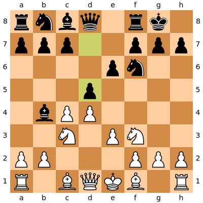
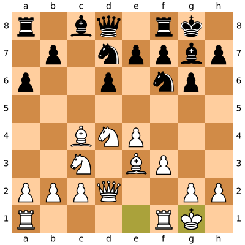

# Chess-AI

A simple chess AI player

## Requirement

- python-chess 0.28.3
- `pip install python-chess`/`conda install python-chess`
- `import chess`

## How to Use

- type "white" or "black" to choose side
- type moves like "d4", "Nf3", "Bxc5", "O-O", "Rfd1", etc.
- input "END" to end the game

## Example

## Power by *gzn00417*

